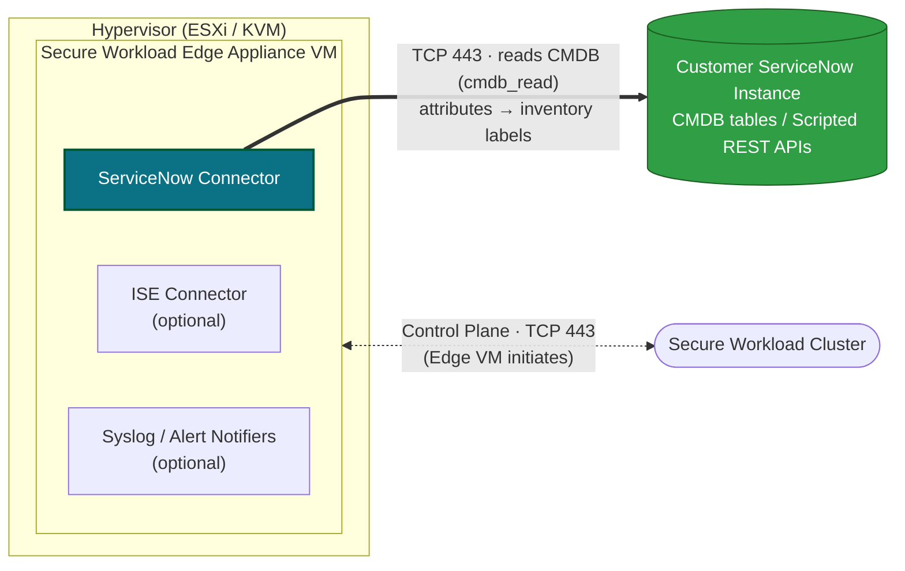

# Cisco Secure Workload — ServiceNow Connector Guide

**A practitioner- and customer-facing guide to the Cisco Secure Workload (CSW) ServiceNow connector — the *Inventory Enrichment* integration that annotates CSW inventory with attributes from your ServiceNow CMDB.**

This repo explains what the connector does (and does not) do, the prerequisites, a step-by-step configuration walkthrough, how the imported labels are used in scopes and segmentation policy, day-2 operations and troubleshooting, and the documented limits — so an SE or customer team can stand it up in a POV or production tenant with no surprises.

> **Disclaimer.** This repository is **not** official Cisco product documentation. It is companion enablement material maintained for customer and partner education. Always validate design, scope, supported features, and exact values against your tenant's in-product documentation and the *Cisco Secure Workload User Guide* for **your release** before making production decisions.

> **Official Cisco documentation — CSW 4.0 (primary source for this guide):**
> [Configure and Manage Connectors — On-Premises 4.0](https://www.cisco.com/c/en/us/td/docs/security/workload_security/secure_workload/user-guide/4_0/cisco-secure-workload-user-guide-on-prem-v40/configure-and-manage-connectors-for-secure-workload.html)
> · [Configure and Manage Connectors — SaaS 4.0](https://www.cisco.com/c/en/us/td/docs/security/workload_security/secure_workload/user-guide/4_0/cisco-secure-workload-user-guide-saas-v40/m-connectors.html).
> A full link + claim-by-claim verification table is in
> [`docs/00-official-references.md`](./docs/00-official-references.md) — **read it first.**

> **Scope of this validation (June 2026).** Every factual claim in this repo — data flow, the *Inventory Enrichment* classification, the Secure Workload **Edge** appliance requirement, ServiceNow role requirements (`cmdb_read`, `web_service_admin`), the table/attribute selection workflow, sync-interval and deletion behavior, ports, the Maintenance Explorer cleanup command, and the published limits — has been cross-referenced against the **CSW 4.0 On-Premises User Guide** "Configure and Manage Connectors" chapter. Where Cisco documents a specific value, this repo cites it. Where Cisco's own documentation is **internally inconsistent** (two such cases exist — attribute count and deletion interval), this repo flags it openly rather than guessing; see [`docs/07-validation-notes.md`](./docs/07-validation-notes.md).

---

## 📖 Guide contents — start here

Read in order, or jump straight to what you need. Each link opens the full page.

| # | Guide page | What you'll find |
|---|---|---|
| 00 | **[Official References & Claim Verification](./docs/00-official-references.md)** | Cisco doc links (On-Prem 4.0, SaaS 4.0, 3.9) + a claim-by-claim verification table — **read first**. |
| 01 | **[Overview & Data Flow](./docs/01-overview-and-data-flow.md)** | What the connector is/is not, architecture, and the request sequence. |
| 02 | **[Prerequisites](./docs/02-prerequisites.md)** | Edge appliance, ServiceNow account/roles, MFA, ports/firewall, data-design decisions. |
| 03 | **[Configuration Walkthrough](./docs/03-configuration.md)** | Step-by-step: instance, table/`cmdb_ci` selection, `ip_address` key, attributes, Scripted REST APIs, sync interval, URL params, field-naming cheat sheet. |
| 04 | **[Using the Labels](./docs/04-using-the-labels.md)** | Where labels appear and how to use them in scopes, filters, and policy. |
| 05 | **[Operations & Troubleshooting](./docs/05-operations-and-troubleshooting.md)** | Day-2 sync/deletion, connector alerts, Maintenance Explorer cleanup, common issues. |
| 06 | **[Limitations & FAQ](./docs/06-limitations-and-faq.md)** | Documented limits and Cisco's FAQ (verbatim, validated). |
| 07 | **[Validation Notes](./docs/07-validation-notes.md)** | Documented-fact audit + the two flagged Cisco doc inconsistencies. |
| 08 | **[No IP? Build a ServiceNow View](./docs/08-no-ip-create-a-view.md)** | Step-by-step Database View (JOIN to an IP-bearing table) for when a CMDB table has no IP field — the FAQ workaround, in full. |
| 09 | **[Scripted REST API Example](./docs/09-scripted-rest-api-example.md)** | Working Scripted REST API (pagination + calculated fields) for when a Database View can't express the data — the server-side-logic path. |
| 10 | **[Customer Brief: No-IP-Key View & Export](./docs/10-no-ip-customer-brief-view-and-export.md)** | Self-contained hand-to-the-customer brief: why the integration fails without an IP key, the List-view-vs-Database-view clarification, and a concrete IP + hostname + appid + owner + tags → label → policy mapping. |

> **Official Cisco source pages (open directly):** [Connectors — On-Premises 4.0](https://www.cisco.com/c/en/us/td/docs/security/workload_security/secure_workload/user-guide/4_0/cisco-secure-workload-user-guide-on-prem-v40/configure-and-manage-connectors-for-secure-workload.html) · [Connectors — SaaS 4.0](https://www.cisco.com/c/en/us/td/docs/security/workload_security/secure_workload/user-guide/4_0/cisco-secure-workload-user-guide-saas-v40/m-connectors.html) · [Connectors — On-Premises 3.9](https://www.cisco.com/c/en/us/td/docs/security/workload_security/secure_workload/user-guide/3_9/cisco-secure-workload-user-guide-on-prem-v39/configure-and-manage-connectors-for-secure-workload.html)

---

## TL;DR — what this connector is

| Question | Answer (per CSW 4.0 User Guide) |
|---|---|
| **Connector family** | **Inventory Enrichment** — it does *not* ingest flows or create inventory. |
| **What it does** | Connects to a ServiceNow instance, reads CMDB tables / Scripted REST APIs, and **annotates CSW inventory IP addresses with ServiceNow attributes as labels.** |
| **Where it runs** | The **Secure Workload Edge** virtual appliance. |
| **Key requirement on each table** | The source table/view **must contain an IP Address field**, and you **must select the `ip_address` attribute as the *key*** — CSW keys records off it. A table with no IP field **cannot be integrated**. |
| **ServiceNow permissions** | `cmdb_read` (tables) and `web_service_admin` (Scripted REST APIs). |
| **Default sync** | Every **60 minutes** (configurable as *Data fetch frequency*). |
| **Egress** | Edge VM → ServiceNow over **TCP 443**; Edge VM → CSW cluster over **TCP 443**. The Edge VM always initiates. |
| **Not supported** | ServiceNow instances that **require MFA**. |

> **Mental model:** the ServiceNow connector is a *metadata feed*. It does not discover or create workloads; it decorates IPs that CSW already knows about with business context (owner, environment, app, location, support group, etc.) so you can build **label-driven scopes and segmentation policy** off your system of record.

---

## Architecture

The connector runs on the **Secure Workload Edge** appliance (a VM on your ESXi/KVM hypervisor). The Edge appliance keeps a **control-plane** session to the Secure Workload cluster, and the **ServiceNow connector** reaches out to the **customer's ServiceNow instance** to read CMDB tables / Scripted REST APIs and turn those attributes into inventory labels.

> This mirrors the standard Edge-appliance connector topology — the same place ISE and the Syslog/alert notifiers run — but the external endpoint here is the **customer's ServiceNow CMDB instance**, not an alert destination. The connector reads ServiceNow over **TCP 443** (`cmdb_read` for tables, `web_service_admin` for Scripted REST APIs) and the Edge VM talks to the cluster over **TCP 443**, always initiating the connection.

---

## Quick start (high level)

1. **Confirm you have a Secure Workload *Edge* appliance** deployed and healthy for the target tenant (rootscope). See [`docs/02-prerequisites.md`](./docs/02-prerequisites.md).
2. **Create a ServiceNow service account** with `cmdb_read` (and `web_service_admin` if you will use Scripted REST APIs). Confirm the instance does **not** enforce MFA for this account.
3. **Open egress** from the Edge VM to the ServiceNow instance on **443** and to the CSW cluster on **443**.
4. In CSW: **Manage → Connectors → ServiceNow**, enable it on the Edge appliance, and add a **ServiceNow instance** (username, password, instance URL).
5. **Select a table (or view) that has an IP Address field**, pick the `ip_address` attribute as the key, then choose the attributes you want as labels.
6. **Tune the sync interval and delete-entry interval** for table size.
7. **Verify** labels appear on inventory and **use them in scopes / inventory filters / policy.** See [`docs/04-using-the-labels.md`](./docs/04-using-the-labels.md).

Full walkthrough: [`docs/03-configuration.md`](./docs/03-configuration.md).

---

## What's in this repo

All guide pages live in [`docs/`](./docs) — direct links below (same as the **Guide contents** table above):

- 📄 [`docs/00-official-references.md`](./docs/00-official-references.md) — Cisco doc links + claim verification table (read first)
- 📄 [`docs/01-overview-and-data-flow.md`](./docs/01-overview-and-data-flow.md) — what it is, how data flows, what it does NOT do
- 📄 [`docs/02-prerequisites.md`](./docs/02-prerequisites.md) — Edge appliance, ServiceNow account/roles, ports, MFA
- 📄 [`docs/03-configuration.md`](./docs/03-configuration.md) — step-by-step: instance, tables, Scripted REST, sync interval, URL params
- 📄 [`docs/04-using-the-labels.md`](./docs/04-using-the-labels.md) — how labels appear and how to use them in scopes/policy
- 📄 [`docs/05-operations-and-troubleshooting.md`](./docs/05-operations-and-troubleshooting.md) — sync, deletion, Explore cleanup, alerts, common issues
- 📄 [`docs/06-limitations-and-faq.md`](./docs/06-limitations-and-faq.md) — published limits + Cisco FAQ (verbatim, validated)
- 📄 [`docs/07-validation-notes.md`](./docs/07-validation-notes.md) — documented-fact audit + flagged Cisco doc inconsistencies
- 📄 [`docs/08-no-ip-create-a-view.md`](./docs/08-no-ip-create-a-view.md) — full step-by-step Database View (JOIN) for tables with no IP field
- 📄 [`docs/09-scripted-rest-api-example.md`](./docs/09-scripted-rest-api-example.md) — Scripted REST API example (pagination + calculated fields)
- 📄 [`docs/10-no-ip-customer-brief-view-and-export.md`](./docs/10-no-ip-customer-brief-view-and-export.md) — customer brief: why no-IP-key fails, List-vs-Database-view, IP + hostname + appid + owner + tags → label → policy

---

## Who this is for

- **SEs / SAs** running a CSW POV who need ServiceNow CMDB context to drive label-based segmentation.
- **Platform / CMDB owners** who must provision the ServiceNow service account, roles, tables/views, and firewall egress.
- **Customers** evaluating whether the connector fits their system-of-record-driven labeling strategy.

---

## Related Cisco Secure Workload Resources

Other public repositories covering the full Cisco Secure Workload journey — from onboarding to compliance reporting:

| Repository | What It Covers | Best For |
|---|---|---|
| [**CSW-User-Education**](https://github.com/chandrapati/CSW-User-Education) | Intro guide, curated video library, and customer onboarding runbook | Anyone new to CSW — great first stop |
| [**CSW-Agent-Installation-Guide**](https://github.com/chandrapati/CSW-Agent-Installation-Guide) | Host agent install across Linux, Windows, cloud, containers, and agentless environments | Operations and deployment teams |
| [**CSW-Policy-Lifecycle**](https://github.com/chandrapati/CSW-Policy-Lifecycle) | Full policy lifecycle: ADM discovery → Monitor → Simulate → Enforce + day-2 ops | SE/SA and customer engineering |
| [**csw-splunk-integration**](https://github.com/chandrapati/csw-splunk-integration) | Step-by-step CSW → Splunk integration via Syslog connector and Cisco Security Cloud App | Security operations teams |
| [**CSW-Compliance-Mapping**](https://github.com/chandrapati/CSW-Compliance-Mapping) | Compliance reports and SA/SE runbooks for 30+ frameworks (HIPAA, SOC 2, PCI DSS v4, NIST 800-53, ISO 27001, CISA ZTMM, FIPS 140, and more) | CISO, GRC, and audit teams |
| [**CSW\_POV\_Template**](https://github.com/chandrapati/CSW_POV_Template) | Reusable POV engagement toolkit — clone for each new engagement | SEs running a CSW proof-of-value |
| [**csw\_blast\_radius\_demo**](https://github.com/chandrapati/csw_blast_radius_demo) | Hands-on demo showing blast radius reduction via microsegmentation | Demo and lab environments |

> **Where this repo fits:** the ServiceNow connector is part of the **label strategy** that precedes good policy. Pair it with **CSW-User-Education** (concepts) and **CSW-Policy-Lifecycle** (turning labels into segmentation).
